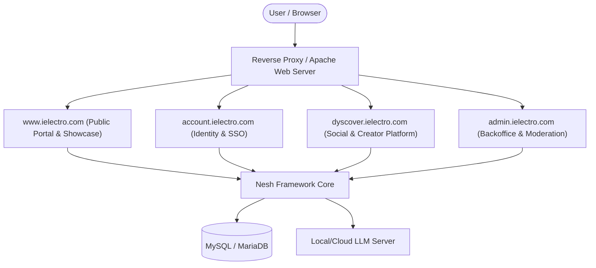

# iElectro Platform & Nesh Framework

> **iElectro** is a modular, high-performance web platform built on a multi-application (multi-subdomain) architecture and powered by an internal, purpose-built PHP framework named **Nesh** (`/nesh`).

---

## 📑 Table of Contents

1. [Architecture Overview](#1-architecture-overview)
2. [Project Directory Structure](#2-project-directory-structure)
3. [The Core Framework: Nesh](#3-the-core-framework-nesh)
   - [Routing & Page Rendering Engine](#routing--page-rendering-engine)
   - [API Dispatching & Conventions](#api-dispatching--conventions)
   - [Database Layer & Auto-Migrations](#database-layer--auto-migrations)
   - [Authentication & Security](#authentication--security)
   - [AI Module (LLM Integration)](#ai-module-llm-integration)
   - [Media & Document Processing](#media--document-processing)
4. [Applications Breakdown](#4-applications-breakdown)
   - [account (Identity Provider)](#account-httpsaccountielectrocom)
   - [dyscover (Social & Creator Hub)](#dyscover-httpsdyscoverielectrocom)
   - [admin (Backoffice & Moderation)](#admin-httpsadminielectrocom)
   - [www (Public Showcase & Portal)](#www-httpswwwielectrocom)
5. [Technology Stack & Dependencies](#5-technology-stack--dependencies)
6. [Local Installation & Setup](#6-local-installation--setup)
7. [CLI Tooling (Nesh CLI)](#7-cli-tooling-nesh-cli)

---

## 1. Architecture Overview

The entire ecosystem is designed to operate on dedicated subdomains sharing a single sign-on (SSO) session, a consistent design system, and unified core backend infrastructure:



* **SSO & Cross-Subdomain Cookies**: Authentication tokens are stored with a wildcard domain (`.ielectro.com`), enabling seamless Single Sign-On (SSO) across all subdomains.
* **Database Isolation**: Each primary application maintains its own dedicated database schema (`ielectro_account`, `ielectro_dyscover`, `ielectro_admin`).

---

## 2. Project Directory Structure

```
ielectro/
├── nesh/                     # Core Framework & Shared Libraries
│   ├── ai/                   # LLM client module (OpenAI, Ollama, llama.cpp, Qwen...)
│   ├── cli/                  # Command-line tools (install, deploy, database...)
│   ├── data/                 # Static datasets and GeoIP databases
│   ├── database/             # Database management helpers
│   ├── fonts/ & icon/        # Shared typography and icon assets
│   ├── scripts/ & styles/    # Core design system and client-side modules
│   ├── src/                  # Core PHP classes (App, Routing, Api, Identity...)
│   └── vendor/               # Composer dependencies (Dompdf, GeoIP2...)
├── account/                  # Identity Provider and User Profile Management
│   ├── api/                  # API endpoints (user, oauth, sessions, recovery...)
│   ├── assets/               # Branding, user avatars, and static assets
│   ├── data/                 # Activity messages and configuration
│   ├── database/             # Bootstrap SQL migrations for `ielectro_account`
│   ├── pages/                # HTML templates (login, create, profile, security...)
│   ├── scripts/ & styles/    # Application-specific frontend assets
│   └── index.php             # Application entry point
├── dyscover/                 # Social Network, Creator Hub & Rich Articles
│   ├── api/                  # API endpoints (posts, articles, inbox, explore, ai...)
│   ├── assets/               # User uploads (articles, images, videos, documents)
│   ├── database/             # Bootstrap SQL migrations for `ielectro_dyscover`
│   ├── pages/                # HTML templates (feed, home, explore, inbox, creator...)
│   ├── scripts/ & styles/    # Social platform UI and logic
│   └── index.php             # Application entry point
├── admin/                    # Backoffice and Management Dashboard
│   ├── api/                  # API endpoints (accounts, careers, news, team, dyscover...)
│   ├── assets/               # Uploaded CVs, team photos, and brand media
│   ├── database/             # Bootstrap SQL migrations for `ielectro_admin`
│   ├── pages/                # HTML templates (accounts, careers, news, team...)
│   ├── scripts/ & styles/    # Dashboard UI components
│   └── index.php             # Application entry point
├── www/                      # Public Corporate & Showcase Website
│   ├── api/                  # Public tracking and stats API endpoints
│   ├── assets/               # Corporate imagery and branding
│   ├── pages/                # HTML templates (home, news, careers, services, team)
│   ├── scripts/ & styles/    # Public showcase UI
│   └── index.php             # Application entry point
└── index.php                 # Root entry redirect to /www
```

---

## 3. The Core Framework: Nesh

**Nesh** (`/nesh/src`) is a lightweight, object-oriented PHP 8 framework crafted specifically for iElectro's multi-application architecture.

### Routing & Page Rendering Engine
* **Automatic View Resolution**: A request to `https://account.ielectro.com/login` resolves directly to `account/pages/login.html`.
* **Dynamic `<head>` Injection (`Pages.php`)**: Nesh inspects the HTML template and injects:
  * Matching stylesheet: `/styles/{page}/index.css`
  * Matching JavaScript module: `/scripts/{page}/index.js` (`type="module"`)
  * Favicon, security headers, UTF-8 charset, responsive viewport, and the configured application title suffix.

### API Dispatching & Conventions
API routes follow a structured endpoint convention:
`METHOD /api/{service}/{method?}/{id?|uuid?|slug?}`

* Handled by `Api.php`, routes dynamically instantiate corresponding classes in the application namespace (e.g., `Account\User`, `Dyscover\Posts`, `Admin\Careers`).
* **Built-in Protection**:
  * Mutation methods (`POST`, `PUT`, `PATCH`, `DELETE`) strictly enforce active authentication and CSRF token validation (unless routes are explicitly marked in `$app->api->publicApi`).
  * Transparent parsing of JSON bodies through `Request::body()`.

### Database Layer & Auto-Migrations
* Backed by PDO/MySQLi wrappers in `Database.php` and `Query.php`.
* On application boot (`App::boot()`), if the `.booted` indicator file is absent:
  1. The target database is created automatically if it does not exist.
  2. All `.sql` migration files in the application's `database/` folder are executed in natural sort order.
  3. The `.booted` file is generated to bypass future redundant schema checks.

### Authentication & Security
* **Cryptographic Sessions**: 64-character session tokens are stored as SHA-256 hashes in `account_sessions`.
* **Client Fingerprinting & Geolocation**: Sessions track IP address, GeoIP Country/City (via MaxMind GeoIP2), OS, browser engine, and device user-agents.
* **Hardened Security**: Built-in sliding rate-limiting (`RateLimit.php`), clickjacking protection (`X-Frame-Options`), XSS prevention, and strict cookie attributes (`HttpOnly`, `SameSite=Lax`, `Secure`).

### AI Module (LLM Integration)
The `Nesh\Ai` module (`nesh/ai/client.php`) provides an OpenAI Chat Completions-compatible client:
* Supports local backends (**Ollama**, **llama.cpp**, **vLLM**) and cloud APIs (**OpenAI**, **Anthropic**, **Groq**, **Qwen**).
* **AI Capabilities in Dyscover**:
  * AI-assisted article generation and drafting (`article-generate.php`).
  * Automatic post tagging, content classification, and topic extraction (`post-tag-enricher.php`).
  * Playbook and knowledge graph extraction (`article-knowledge.php`, `article-playbook.php`).

### Media & Document Processing
* **Images**: Resizing, format conversion (WebP, AVIF, PNG, JPG), and optimization via PHP GD (`Image.php`).
* **Audio & Video**: Transcoding, thumbnail extraction, and media inspection via FFmpeg (`Video.php`, `Audio.php`).
* **PDF Documents**: Server-side HTML-to-PDF rendering for articles, resumes, and reports powered by `Dompdf` (`Pdf.php`).

---

## 4. Applications Breakdown

### `account` (https://account.ielectro.com)
The centralized Single Sign-On and user identity management provider.
* **Key Features**:
  * User registration with real-time username and email availability checks.
  * Native credential login and **Google OAuth 2.0** integration.
  * Active session tracking with remote revocation across different devices.
  * Email verification and secure password recovery flows with expirable tokens.
  * Avatar upload, cropping, and serving pipeline.
  * Comprehensive security audit trail and activity logging (logins, password updates, profile changes).

### `dyscover` (https://dyscover.ielectro.com)
A social networking and content creator platform for technology and electronics enthusiasts.
* **Key Features**:
  * **Personalized Feeds & Explore**: Algorithmic and chronological feeds based on follows, trending topics, and tags.
  * **Multimedia Posts**: Support for multi-image galleries, embedded audio clips, and video streaming.
  * **Rich Article Editor**: Long-form article authoring with HTML formatting, creator templates, and one-click PDF export.
  * **AI Workspace**: AI-assisted article synthesis, auto-tagging, and structured knowledge extraction.
  * **Direct Messaging (Inbox)**: Private 1-on-1 messaging and conversation management.
  * **Creator Center**: Analytics on post impressions, views, user engagement, and reach.
  * **Moderation Suite**: Automated banned keyword filtering (`banned_terms`), user report queues (`reports`), and administrative actions.

### `admin` (https://admin.ielectro.com)
The administrative backoffice dashboard for staff and operations.
* **Key Features**:
  * **Account Management**: Global account directory, deep inspect, temporary suspensions, and permanent bans.
  * **Careers & Recruiting**: Job listing lifecycle management and application review (including CV PDF viewer and downloads).
  * **News Room**: Publishing, scheduling, editing, and archiving official news published on the corporate portal.
  * **Team Management**: Staff roster management displayed on the public team page.
  * **Analytics & Dyscover Moderation**: Real-time traffic monitoring and resolution of user moderation tickets.

### `www` (https://www.ielectro.com)
The public corporate website and service portal.
* **Pages**:
  * `home.html`: Company mission, technological offerings, and flagship highlights.
  * `news.html`: Live news feed fed directly from the admin publishing system.
  * `careers.html`: Open vacancies with an interactive job application submission form.
  * `services.html`: Breakdown of core products and enterprise services.
  * `team.html`: Team member directory with LinkedIn and GitHub links.

---

## 5. Technology Stack & Dependencies

* **Backend**: PHP 8.1+ (strict typing, match expressions, object-oriented design).
* **Database**: MySQL 8.0+ / MariaDB 10.4+ (InnoDB engine, UTF8mb4).
* **Web Server**: Apache 2.4+ with `mod_rewrite` enabled.
* **Frontend**: Semantic HTML5, Modern CSS3 (Custom Properties, Flexbox, Grid), Vanilla JavaScript (ES6+ Modules).
* **Composer Dependencies**:
  * `dompdf/dompdf`: Server-side PDF generation.
  * `geoip2/geoip2`: IP-based geolocation resolution.
* **Optional System Binaries**:
  * `ffmpeg` / `ffprobe`: Video and audio transcode processing for Dyscover.
  * Local/Remote LLM Server: Ollama, llama.cpp, or OpenAI-compatible endpoint.

---

## 6. Local Installation & Setup

### 1. Requirements
* A local LAMP / WAMP / XAMPP stack running PHP 8.1+ and MySQL.
* Enabled PHP extensions: `mysqli`, `pdo_mysql`, `curl`, `gd`, `mbstring`, `fileinfo`, `openssl`.

### 2. Local Domain / Hosts Configuration
Add the following entries to your `hosts` file (`C:\Windows\System32\drivers\etc\hosts` on Windows or `/etc/hosts` on Linux/macOS):
```text
127.0.0.1  ielectro.com
127.0.0.1  www.ielectro.com
127.0.0.1  account.ielectro.com
127.0.0.1  admin.ielectro.com
127.0.0.1  dyscover.ielectro.com
```

Configure Apache Virtual Hosts to map each subdomain to its corresponding directory (`/www`, `/account`, `/admin`, `/dyscover`).

### 3. Database Credentials
Check or adjust the database connection settings in [`nesh/src/autoload.php`](file:///c:/xampp/htdocs/ielectro/nesh/src/autoload.php):
```php
define('DB_HOST', 'localhost');
define('DB_USER', 'root');
define('DB_PASS', '');
```

### 4. AI Configuration (Optional)
Create `nesh/ai/config.local.php` to connect to your preferred LLM provider:
```php
<?php
define('LLM_PROVIDER', 'ollama'); // Options: 'ollama', 'openai', 'groq', 'custom'
define('LLM_BASE_URL', 'http://localhost:11434/v1');
define('LLM_MODEL', 'qwen2.5:7b');
define('LLM_API_KEY', '');
```

### 5. Initialize Databases
Run the CLI installation command to provision all databases and tables:
```bash
php nesh/cli/nesh install
```

---

## 7. CLI Tooling (Nesh CLI)

The platform includes a CLI utility to automate maintenance, schema management, and production deployments.

Display available commands:
```bash
php nesh/cli/nesh help
```

### Key Commands:

* **Initialize Databases**:
  ```bash
  php nesh/cli/nesh install
  ```
* **Build Deployment Package**:
  Generates an optimized deployment build, normalizes base URLs, updates asset cache-busting stamps, and packages a deployment ZIP:
  ```bash
  php nesh/cli/nesh deploy https://www.yourdomain.com 1.0.0 --db db_name --db-host localhost --db-user username --db-pass password
  ```
* **Rename Application Database**:
  ```bash
  php nesh/cli/nesh database account new_account_db https://account.yourdomain.com
  ```
* **Fix Asset Image Filenames (Match DB Post UUIDs)**:
  ```bash
  php nesh/cli/nesh fix-images
  # Options: --user <id|all>, --dry-run, --app <folder>
  ```

---

## 📄 License & Authors
* **Platform**: iElectro
* **Framework**: Nesh (v1.0.0)
* **Copyright**: © iElectro. All rights reserved.

